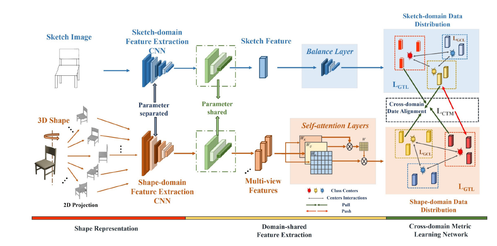

# JMLN: Joint Metric Learning Network for 2D Sketch-based 3D Shape Retrieval
Sketch-based 3D Shape Retrieval

## Introduction

The code is used in the paper of JMLN, which attempts to further  improve the cross-domain retrieval task. The framework is shown as followings:



## Environment

The code has been tested successfully on Ubuntu 18.04.3 LTS, Cuda 10.0, GTX 1080 Ti,  Pytorch 1.4.0, Docker images ufoym/deepo:all-py36-cu100.

Note: Using docker is suggested.

## Update
## Data and Pre-trained Models
**Training and Test Data**

Please put related dataset into ```dataset/```


## Usage
### Training and Test

```
# training 
sh train_all.sh

# Test after training
sh extract_all.sh
```


